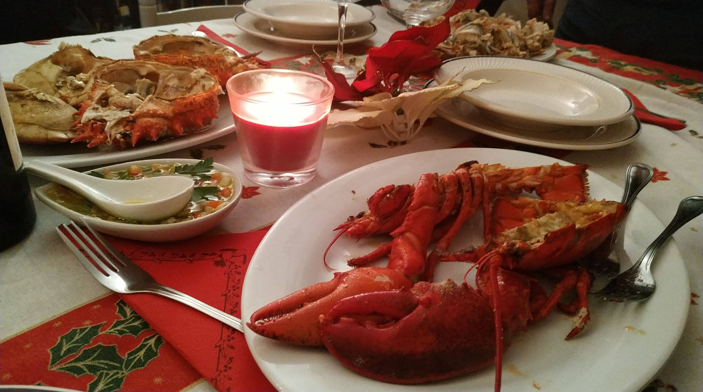

# Cerrando el 2021

*Fuente: Cena de nochebuena

Suele suceder que cuándo finaliza un año, casi de forma involuntaria, hacemos balance del mismo. Cómo nos ha ido, si hemos alcanzado nuestras metas, como nos sentimos, en qué punto estamos a nivel profesional, personal, social, los viajes que hemos hecho, los que no hemos hecho, etc...

Estos dos últimos años, pese a que no los hemos saboreado como nos gustaría, seguro que no los olvidaremos. En nuestro recuerdo, nos cuesta retener nuestros grandes momentos, nuestras mejores experiencias. Sin embargo, todos y cada uno de los peores sentimientos, nuestros fracasos, nuestras pérdidas, nuestros arrepentimientos, parecen estar grabados a fuego, y nuestros fantasmas parecen estar reunidos en el mismo lugar, esperándonos confortables... Esperando pacientemente como francotiradores a que nuestra moral baje, a que recibamos el enésimo golpe en nuestras vidas, a que nos sintamos desgraciados, desafortunados, desdichados. Solos.

A nadie le gusta sentirse así. Y el cúmulo, la repetición de estos malos sentimientos y la falta de recursos a la hora de luchar contra ellos, contra nuestros fantasmas, va cargando nuestras mochilas, haciendo de nuestras vidas una carga pesada, dando a veces la sensación de que la única forma de liberarnos de esta carga sea quitándonos la vida.

Saber gestionar todas estas presiones, todas estas circunstancias no es sencillo, especialmente en esta epoca dónde tenemos un exceso de información, la gran mayoría de las veces sesgada, sobre supuestos ejemplos de éxito, de estilos de vida, de lujos, de modas o de viajes inalcanzables, entre otros. Y si en algún momento lo alcanzamos, la felicidad que nos supone dura apenas un instante.

Por otra parte, estamos viendo ejemplos de celebridades que están teniendo graves dificultades a la hora de gestionar sus propias presiones, sus propias circunstancias. Su propia felicidad. Hace escasos días, los medios se hicieron eco del suicidio de Verónica Forqué, un mito de nuestro cine, y en las pasadas olimpiadas hemos visto como Simone Byles, la atleta llamada a ser leyenda en las disciplinas de gimnasia artística, alegó problemas de salud mental, no participando en las pruebas olímpicas.

Definitivamente, las exigencias de una atleta profesional de alta competición, o de un mito del cine, y especialmente su exposición y estar continuamente tanto ellas como sus familias bajo los focos y el continuo escrutinio del gran público no es un plato agradable de digerir.

Sin embargo, no podemos ni debemos tratar de eliminar todos estos costes ni todas estas fatigas que vienen asociadas al éxito, por muy simple que este sea. Todos y cada uno de nosotros hemos sufrido en nuestras vidas, hemos tenido pérdidas y fracasos, y nos hemos regodeado en nuestro propio sufrimiento como una espiral viciosa. Hemos rechazado ofertas cuyo requerimiento excedía nuestra disposición ó voluntad, o las aceptamos sabiendo el alto coste que conllevaba, manteniendónos lejos de nuestra familia, de nuestros seres queridos y de nuestra zona de confort, pagando altos costes para poder llegar a buen puerto. El haber superado todas y cada una de estas adversidades nos ha hecho más grandes, y merece la total admiración. Y el hecho de no poder o simplemente no querer hacerlo, merece el más absoluto respeto. No obstante, el tratar de suprimir costes y buscar atajos para alcanzar el éxito nos hace menos grandes.

Pese a que todavía está habiendo un número de casos importantes y graves afectaciones, la pandemia parece estar en una fase menos agresiva y más controlada. No cabe duda de que estos años no los olvidaremos, que han sido un verdadero desastre, pero también es cierto que seremos más duros, más resistentes, y desde luego, saborearemos mejor cada éxito, cada viaje, cada momento de libertad, que será verdaderamente legítimo y merecido.

[volver al blog](https://hugotechandtravel.netlify.app/#/gentes_de_martes/)