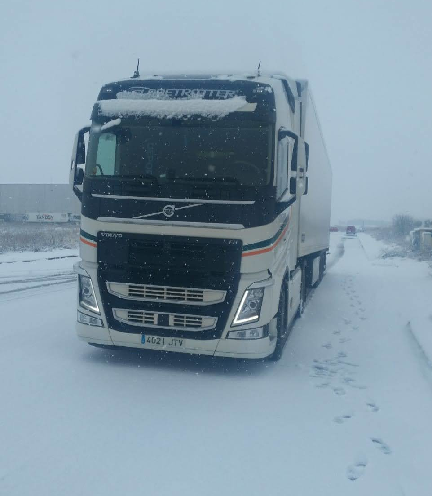

# La ruta hacia el desastre.

*Fuente: Móvil de mi padre, parado en algún punto lejos del confort.*

No conozco otra realidad, y son casi ya 33 primaveras viéndolo en primera persona. Sus ventajas, sus inconvenientes, y cómo se ha ido degradando el oficio. En todo ese tiempo, amigos, allegados, gente ajena a su realidad, han compartido conmigo opiniones de todo tipo. “Tiene que molar ser camionero”, dicen algunos. “Vas tú sólo, nadie te molesta, duermes por ahí, conoces mundo… tiene que molar”, afirman. Otros se quedan todavía más en la superficialidad: “Son unos cerdos”, “puteros”, “algunos son un peligro al volante”, “ir detrás de un camión es un coñazo”, “si hay camioneros, es que se come bien”. Clichés, tópicos…

Obviamente, al igual que en todas las profesiones, hay de todo. Nada nuevo bajo el sol. Sin embargo, con la que está cayendo, sería oportuno hacer una serie de consideraciones. Sería apropiado.

Y es que todos tenemos la memoria muy corta. Y la vista parece que también, por muy bien que veamos de lejos. No hace mucho, en plena época de pandemia, mientras todos estábamos encerrados, este sector no conoció de paros ni de teletrabajo. Pero restaurantes, bares, y establecimientos varios que hacían, hacen y harán la vida de un transportista más llevadera, se vieron abocados al cierre. Esto, hizo que no dispusiesen de un plato de comida caliente ni de la posibilidad de una cama confortable aquellos que hicieron posible que llegasen nuestros pedidos de Amazon, que se repusiera el stock de papel higiénico que compramos como obsesos o que pudiésemos montarnos oficinas improvisadas en nuestras casas.

Son muchos los sacrificios que este oficio trae consigo, más que el oficio en sí mismo. Se pierde el contacto, se enfrían las relaciones, se apaga la llama, se pierde la chispa… Pero sobre todo, se pierden momentos. Al volver de la ruta, un día te das cuenta de que esa pareja vital ha cambiado, o quizás has cambiado tú. No has estado cuándo estaba enferma, o cuándo tú lo estuviste. Los bebés que un día fueron adorables, se han convertido en adolescentes inaguantables que han suspendido 6, y la única conversación que vas a tener con él esa semana no va a ser agradable…

Lo cierto es que nos estorban. Contaminan. Consumen mucho carburante. Van despacio. Ocupan mucho espacio en la carretera. Y en los aparcamientos. Y sus accidentes no son una broma… Su mantenimiento y sus recambios no son baratos. De hecho, los prohibimos cuándo nos interesan. Prohibimos que circulen cuando nos vamos de vacaciones. O en las ciudades. ¿Que se han creído? Que se quedé ese camión en esa area de servicio en Semana Santa para que pueda circular sin problemas yo y mi pariente e irnos tranquilos de vacaciones a la costa. Total, ¿qué tiene que hacer ese transportista en esas señaladas fechas en la ruta? ¿Volver para pasar esos festivos en familia? ¿Traer productos para el supermercado y que pueda disponer de ellos cuándo a mí haga falta? Migajas…

Sin embargo, pobre de aquel que ose no entregar nuestro paquete a tiempo. Qué conduzcan 24 horas seguidas si hace falta, que entren en la ciudad si es necesario. Qué traiga mi pedido un camionero sin experiencia o sin licencia si eso me va a permitir ahorrar unos euros en el porte. Al diablo si provoca un accidente, si un conductor experimentado se queda en el paro, o si no se obtiene beneficio con el porte. ¡Quiero mi pedido, y ahora!

Tenemos un grave problema cuándo producir no es rentable, cuándo transportar no es rentable. Lo único que resulta rentable en este país es vender humo y mentir, y paradójicamente, dudo que esto nos sea rentable.

[volver al blog](https://hugotechandtravel.netlify.app/#/gentes_de_martes/)