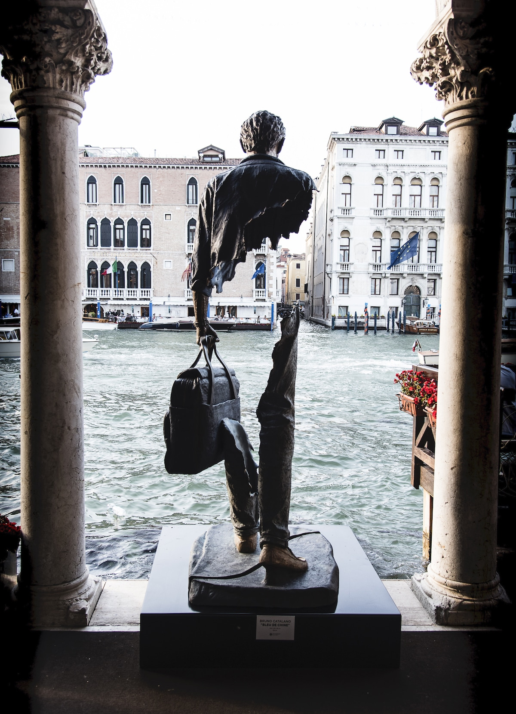

# Cargando la maleta

*Bleu de Chine, Estatua de Bruno Catalano*
*Fuente: https://mymodernmet.com/es/bruno-catalano-viajeros-venecia/*

Me impactó muchísimo. Y todavía lo sigue haciendo. La imagen. Esta que indico en portada.

Una maleta pesada, dónde llevamos nuestros enseres, aquello que consideramos imprescindible. Sin embargo, el contenedor más relevante no es la maleta física, sino nuestro cuerpo y mente, y el contenido más pesado no es la ropa, ni el calzado, sino paradójicamente aquello que no pesa físicamente, como las ausencias, los fantasmas, el desarraigo, nuestros pensamientos y reflexiones.

Pienso en esto desde mi apartamento en el que llevo apenas unos meses en mi nuevo destino. El enésimo. Y sé que definitivamente, no será el último. Pienso en esta imagen, en las veces que hice y deshice esa pesada maleta. En las veces en las que las ausencias se presentaron, en las que los fantasmas me quitaron el sueño, en las que el desarraigo me hizo sentir extranjero en hasta mi propio cuarto, y mis pensamientos y reflexiones no dieron lugar a otra cosa que no fuesen precisamente eso, más pensamientos y más reflexiones.

Afortunadamente, el tener que coger la maleta y marcharse, también trae cosas positivas. Cambia la mirada. Hace la piel más dura. Y si las cosas salen bien, se van llenando nuestros contenedores con contenidos que no esperabamos, que hacen que las ausencias disminuyan su presencia, que nuestros fantasmas duerman, que al menos nos sintamos cómodos en el lugar de destino, y que cambiemos pensamientos y reflexiones por ser protagonistas de nuestras vidas, y quizás, cómplices de otras.

Sin embargo, este cambio personal que uno experimenta, esta nueva mirada con la que se observa la realidad, nuestro entorno, nuestras relaciones, incluso nuestro lugar de origen, quienes hemos sido, con quien compartimos la vida, y las distintas elecciones vitales que nuestro entorno ha ido escogiendo y escoge, hasta la política, nos deja una cierta desazón. El escrutinio que se realiza bajo esta nueva mirada más crítica, más lúcida, qué conoce que hay más allá de sus fronteras y que ha luchado contra diferentes tipos de adversidades, se vuelve mucho más exigente, menos comprensiva y menos piadosa.

Extraña sensación. Disfrutamos con mayor intensidad la compañía, la naturaleza, el paisaje, la amistad, hasta nos sabe mejor la cerveza y la comida de siempre. Pero los retos, conflictos y estímulos que se nos presentan una vez retornado nos resultan menos interesantes, requieren de una resolución más farragosa, menos productiva, y en general, menos edificante. El estilo de vida acaba siendo más simple, más limitado, y nuestro entorno no acaba de entender nuestra posición ni nuestras inquietudes. De hecho, los únicos que parecen entendernos son aquellos que compartieron momentos, cervezas y terrazas con nosotros lejos. Tanto en el tiempo como en el espacio, y ahora ambos semejan tan lejanos...

Por lo que al final, pese a que ya no vamos cargando con nuestras maletas al retornar, estas nuevas ausencias vuelven a presentarse, a ser echadas de menos, y vuelve a iniciarse el bucle, fantasmas que vuelven, el desarraigo del propio lugar de origen, y reflexiones y pensamientos que no cesan.

Llegado este punto, uno se pregunta, ¿qué cuesta más, emigrar o retornar? Pienso en esto viendo como llueve desde mi terraza en "casiña". No puedo evitar que se me escape una sonrisa, que me invada una cierta calidez. Y tampoco puedo evitar los recuerdos que me evoca la estatua de la imagen, esos vacíos que sentí y siento, y que jamás volverán, al menos no en la forma que recuerdo. Esas cervezas que no tomo, esos retos que antaño motivaban, y que ahora están sumidos en la precariedad global, y más que van a estar con la que se nos viene encima con las consecuencias de la pandemia...

Me pregunto también sí uno se ha de considerar afortunado por tener este prisma adicional con el que ver la realidad diaria, pues no acaba de ser agradable lo que se ve, aunque cierto es que se observa de un modo más nítido, más real, y va a ser más díficil que uno pueda ser engañado.

Querer ver la realidad o vivir en la ignorancia. A veces, díficil decisión.

[volver al blog](https://hugotechandtravel.netlify.app/#/gentes_de_martes/)