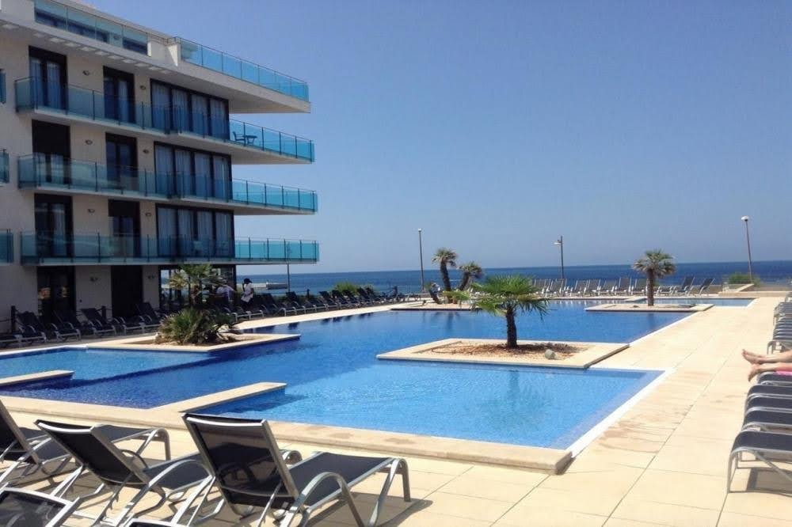

# Hostelería, la incomprendida.

*Aparthotel Ferrer Skyline, en Menorca. Último hotel dónde trabajé*

Creo que es una magnífica escuela para la vida. La hostelería. Jovenes, algunos incautos deseando desarrollar su carrera, otros, incautos también, buscando un salario con el que pagar ese alquiler, ese coche, ese seguro... esa indepencia y esa libertad. No conozco mejor pasaporte para los mortales que estar dispuesto a trabajar dónde sea en este sector. Por otra parte, están los que llevan toda su vida, sean más o menos mayores. Han trabajado en varios restaurantes, hoteles o bares, sujetos a horarios perros, a mostrar una sonrisa infinita, a la estacionalidad, a jefes duros, a salarios insuficientes, a clientes cada vez más exigentes, con menos disposición a valorar y pagar por el servicio. Tanto de forma interna como externa. Y buscando pagar esa hipóteca, ese coche, ese seguro, la comida y la ropa del crío, su juego de la play... subsistir, ir tirando, y gracias.

Por tanto, no es una cuestión del PIB, y de su aportación. No es una cuestión de cuánto, sino de cuántos. De cuántas nóminas se pagan en la hostelería. De cuántas hipótecas se pagan gracias a la hostelería. De cuántos alquileres se pagan gracias a la hostelería. De cuánto y cuántos alquileres se pagan en los restaurantes, bares y cafeterías. Ya no digamos del alquiler del edificio o edificios de un hotel en una ubicación privilegiada... Y de cuántas habitaciones hay que limpiar, de cuántas comidas hay que elaborar, de cuántos platos hay que servir y después limpiar, de cuántos check in hay que realizar. Cuántas tareas, cuántos esfuerzos, cuántas horas para llegar al menos a subsistir. Tanto empleados como el negocio en sí mismo. A veces, ni se llega.

Y a veces, no queda mucha más alternativa en demasiados lugares que precisamente la hostelería. Y bendita alternativa.

Pienso en la reciente intervención de la mujer del presidente del gobierno, o en cualquiera intervención de algún miembro de este gobierno respecto a este sector, y definitivamente ni conocen a la sociedad para la que gobiernan, ni conocen el sector más importante del país, ni hacen el mínimo esfuerzo en comprender, sino que actúan con total arrogancia en base a unos criterios totalmente peregrinos, infantiles, y tremendamente alejados del mundo real.

Esta semana la mujer del presidente del gobierno nos brindó a todos los contribuyentes con unas declaraciones en las que se instaba al sector a ir un paso más allá de la búsqueda de beneficios, tarea de por si tremendamente compleja, y que precisamente su marido complica día si y día también. Me pregunto cuántos negocios habrían llegado a cubrir costes con una carga fiscal razonable... Pues que esto no llega. Que los restaurantes deben hacer la inversión correspondiente para convertirse en centros educadores de comida sana.

Decía: *"(los restaurantes) pueden enseñar a la gente a comer bien. Tú puedes decir: ¿Qué hace tu restaurante?, ¿dar comida ó generar educación? Educo en comida sana a mis clientes a través de productos ecológicos de proximidad. Esta frase es completamente diferente a simplemente doy comidas".

Supongo que los dueños de restaurantes se quedarán más tranquilos ahora, sabiendo que la solución a sus problemas es ofrecer productos ecológicos de proximidad y educar a la ciudadanía. Me imagino a los bares de carretera encareciendo 3€ o 4€ el precio para cubrir y cumplir con la mamarrachada de la señora mujer del presidente, y la gente trabajadora encantada de que después de una larga jornada de trabajo, se le niegue un plato de lentejas con chorizo por no ser un plato sano, o "healthy", incluso se le regañe, por qué no, ya que disponemos de esa capacidad moral... Me imagino a esos camioneros en los bares de carretera de toda la vida, yendo a por su menú en un día de invierno buscando algo lo más económico posible, caliente y calórico, como toda la vida se ha hecho, y encontrandose con esta señora diciéndoles que les va a educar, que les va a enseñar a comer bien, que lo que llevan haciendo toda la vida está mal, y que para ello les puede ofrecer una ensalada verde, mucho aguacate, y con suerte un poco de salmón, a 15€ el menú. Eso sí, el aguacate es del super de al lado y el salmón es de la misma noruega. O mejor aún, imagenense esas borracheras estándar que acaban en un kebab. Imaginense al pobre Mohammed indicando a sus clientes hebrios la procedencia de las lechugas, los tomates y la carne con la que hacen sus kebabs. Educando. Y por qué no, regañando a sus clientes los excesos cometidos con el alcohol. Y por supuesto, encareciendo su producto por todo este servicio y valor añadido. El negocio es redondo, y la sostenibilidad del mismo igual, ¡no me digan qué no!

Nos quieren volver unos mentecatos estúpidos sumisos a unos códigos buenistas que al final van por unos derroteros muy alejados de la vida real. Nos acabarán prohibiendo comer un mero estofado de carne, una fabada, unas lentejas o una hamburguesa grasienta después de una noche de farra.

Me pregunto si esta señora conoce cual es el coste de un plato de lentejas, a ver porque este tipo de platos se dan en los menús. Me pregunto cual es el coste de su dieta, y de la de su marido. Me pregunto si una persona que vive en unas condiciones precarias puede pagar una dieta "friendly", "healthy", ecológica, sostenible, con productos de cercanía, y demás epítetos "trendy" (serán capaces de añadir resiliente a la lista, o decir que esta dieta nos hará más resilientes). Me pregunto si sabe lo que es un escandallo. Me pregunto porque no se ayuda a que las personas dejen de vivir en situaciones precarias, a pesar de tener un trabajo o llevar un pequeño negocio y currar como burros, sino que a esa persona que vive en unas condiciones precarias, se la quiera hacer pasar por el aro, que le incrementen el precio de su menú, y que no pueda escoger libremente el plato que llevarse a la boca sin que alguien le de la murga con que lo que está comiendo no es lo suficientemente bueno, o si el producto no tiene la suficiente proximidad.

Dejen a la gente vivir tranquila, que traten de generar riqueza, que coman lo que les de la gana, y si hay alguien que deba dar lecciones, definitivamente no son ustedes.

*Fuente de la noticia:
*https://www.abc.es/espana/abci-mujer-pedro-sanchez-recomienda-hosteleros-educar-comida-sana-para-estar-encima-negocio-202105120918_noticia.html?ref=https:%2F%2Fwww.google.com%2F*

[volver al blog](https://hugotechandtravel.netlify.app/#/gentes_de_martes/)