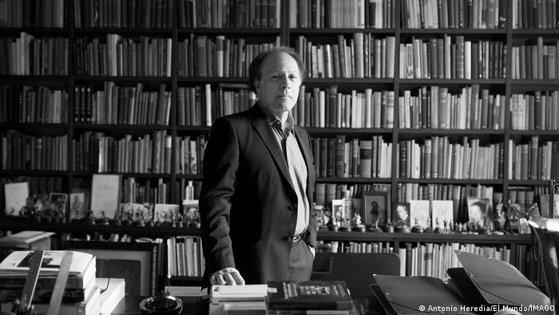

# No he querido saber, pero he sabido.

*Fuente: https://www.dw.com/en/spain-award-winning-author-javier-marias-dies-aged-70/a-63086688

No estará más esta columna sagrada dominical, ni volverá a ver la luz otra creación de este señor, al que una idea, una sola frase de Shakespeare, y una profunda reflexión, lo llevó a una demostración de talento que el resto de los mortales sólo podemos observar y aplaudir.

“No he querido saber, pero he sabido” que las referencias desaparecen, se desvanecen, se van antes de que uno se ubique, se encuadre. Google tiene respuestas para todo y todos, siempre que aceptemos a la superficialidad y a la frivolidad como norma. La mayor.

No obstante, hay rincones oscuros, dobleces y aristas, luces y sombras en nuestro pensamiento. Inquietudes. Pesares. Miedos. Tormentos. Inseguridades…

“Los oídos no tienen párpados, y lo que les llega ya no se olvida”. La palabra de esa persona que nos importa quedará registrada, marcada a fuego, especialmente si es negativa. Aunque no quedará tan marcada como la ausencia de la misma. La falta de consideración y de correspondencia. El desinterés. El silencio.

Es curiosa la selectividad de nuestra memoria, su discriminación, su capacidad de retener hasta el más mínimo detalle de aquellos “hechos acaecidos” que asesinaron con alevosía nuestro ánimo. Recordamos cómo de fuerte apretamos la mandíbula, cómo de saladas estaban nuestras lágrimas más amargas, quizás quién estuvo allí, pero a ciencia cierta recordaremos quién no, y debía estarlo.

Discreto, alejado del foco, fiel a sus ideas, y sobre todo, a expresarlas de la forma más exacta, más justa, más precisa en una máquina de escribir. Mis respetos.

QEPD Javier Marías.

[volver al blog](https://hugotechandtravel.netlify.app/#/gentes_de_martes/)