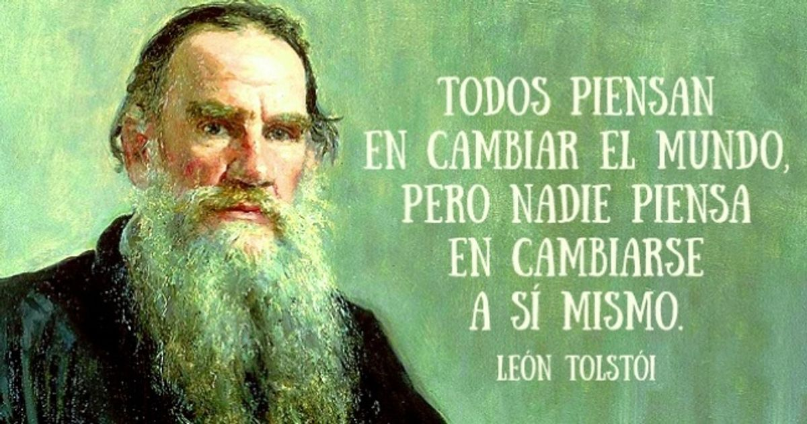

# Pinta tu aldea, y pintarás el mundo.

*Fuente: https://genial.guru/creacion-arte/15-frases-celebres-de-leon-tolstoi-76905/*

Escuché la cita ayer de noche, en una entrevista a Javier Cercas. "Pinta tu aldea, y pintarás el mundo", atribuída a Tolstoi. Y lamenté que, a punto de cumplir 32 primaveras, no la hubiese escuchado antes. 7 palabras que nos obligan a considerar nuestro entorno, qué es lo que lo ha llevado hasta dónde está, qué es lo que lo mueve. Y seguro que no deja de ser muy distinto al de cualquier otro entorno.

Cuántos beneficios traería que esta cita estuviese rotulada en la entrada al parlamento, en las puertas de llegada y salida de los aeropuertos. Aunque quizás acabase manida en tanta story de instagram...

Más de uno consideraría dos veces los juicios de valor que se hacen sobre nuestro propio entorno, sobre nuestra aldea, qué tan buenos ó mediocres fuimos o somos, qué tan diferentes ó parecidos somos de nuestros vecinos, del sitio que visitamos, del sitio al que emigramos o del sitio que tanto criticamos.

Llevamos ya demasiado tiempo con demasiados sobresaltos (algunos inevitables) en lo social, en lo político, en lo diplomático, en lo humanitario, en demasiados campos, sujetos a una intensidad y a una volatilidad que nos están haciendo vivir sin los pies en el suelo. Me pregunto si esta incertidumbre diaria, si esta guerra constante ha sido siempre así, y cómo será en el futuro, y todo soportado por una población joven que afortunada es si dispone de un trabajo con el que pagar el alquiler del sitio dónde vive que se lleva más del 40% de su salario. 

Esta semana surgió un nuevo conflicto diplómatico con nuestros vecinos del sur, país que me acogió y en el que viví, más bien trabajé, durante un año muy intenso. No han tenido el menor miramiento a la hora de permitir que miles de personas que están precisamente en su país, desesperadas por mejorar sus vidas, se lanzasen al mar de forma literal, poniendo en riesgo sus vidas e incluso las de sus hijos. Evitar que esto siguiese sucediendo, nos ha costado a los españoles, a los que apenas podemos pagar el alquiler, 30 millones de euros.

Me pregunto si quienes toman las decisiones diplomáticas y políticas, son capaces de coger esta frase de Tolstoi con la que abro esta entrada, y pintar Marruecos, pintar España, pintar que nos mueve a ambos, y entenderlo.

Cuánto tiempo, esfuerzo y recursos generados por otros que ya están quemados, y más que van a quemarse con los nuevos ajustes fiscales que se avecinan, son dedicados a acciones inútiles y a errores previsibles por nefastas decisiones. Me pregunto por qué tenemos que pagar siempre los mismos, y por qué quienes toman tan malas decisiones se van de rositas.

[volver al blog](https://hugotechandtravel.netlify.app/#/gentes_de_martes/)